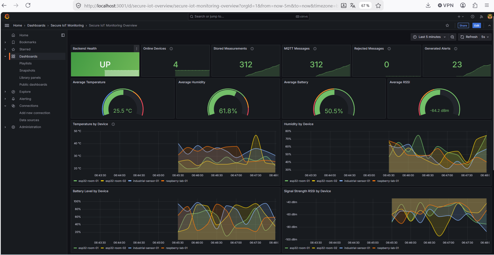
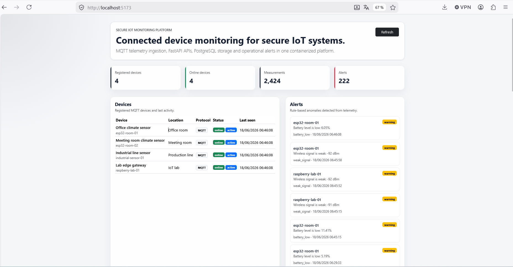
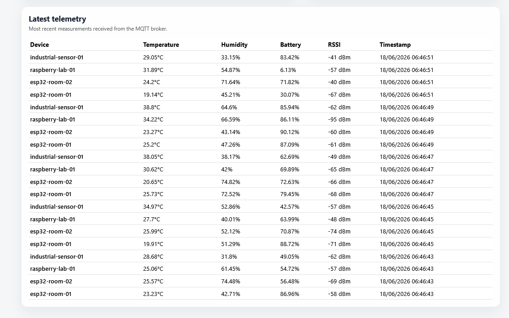
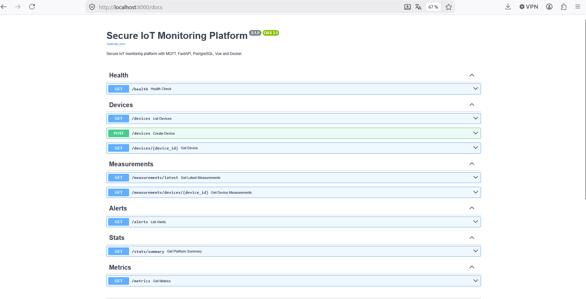
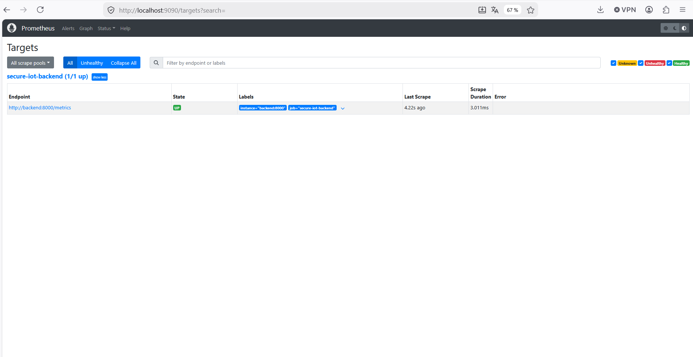

# Secure IoT Monitoring Platform

<p align="center">
  
</p>

<p align="center">
  <strong>Secure, observable and containerized IoT monitoring platform built with MQTT, FastAPI, PostgreSQL, Vue, Prometheus and Grafana.</strong>
</p>

<p align="center">
  
  
  
  
  
  
  
</p>

---

## Overview

**Secure IoT Monitoring Platform** is a complete IoT monitoring project designed to simulate, collect, store, expose and visualize telemetry data from connected devices.

The platform demonstrates how IoT, backend engineering, networking, DevOps, observability and security concepts can be combined into a single end-to-end system.

It includes:

- an MQTT broker for IoT communication;
- a Python IoT simulator publishing device telemetry;
- a FastAPI backend consuming MQTT messages;
- a PostgreSQL database for telemetry persistence;
- a Vue.js dashboard for real-time device visualization;
- Prometheus metrics for monitoring;
- Grafana dashboards for IoT and backend observability;
- Docker Compose orchestration for local deployment.

This project was built as a portfolio-grade engineering project by **HAMAILI Ahmed-Imad**.

---

## Project Preview

### IoT Monitoring Dashboard



### Device Telemetry Details



### FastAPI Documentation



### Grafana IoT Metrics Dashboard


### Prometheus Targets



---

## Main Features

### IoT Data Pipeline

- Simulated IoT devices publish telemetry through MQTT.
- Mosquitto acts as the MQTT broker.
- FastAPI subscribes to MQTT topics and processes incoming messages.
- PostgreSQL stores validated telemetry data.

### Backend API

- REST API built with FastAPI.
- Automatic OpenAPI documentation.
- Endpoints for latest measurements, device data and platform health.
- Structured codebase with services, schemas, models and routes.

### Frontend Dashboard

- Vue.js dashboard for visualizing connected devices.
- Real-time telemetry display.
- Device status, battery, temperature, humidity and RSSI indicators.
- Clean and responsive interface.

### Observability

- Prometheus scrapes backend metrics.
- Grafana visualizes both system and IoT-specific metrics.
- Custom IoT metrics include temperature, humidity, battery, RSSI, active devices and MQTT ingestion activity.

### DevOps

- Full Docker Compose deployment.
- Independent services for backend, frontend, MQTT, PostgreSQL, Prometheus, Grafana and simulator.
- Reproducible local environment.
- Ready to be extended with CI/CD and Kubernetes.

---

## Architecture

```txt
+---------------------+
|   IoT Simulator     |
|  Python devices     |
+----------+----------+
           |
           | MQTT telemetry
           v
+---------------------+
|  Mosquitto Broker   |
| MQTT communication  |
+----------+----------+
           |
           | MQTT subscription
           v
+---------------------+
|   FastAPI Backend   |
| API + MQTT consumer |
+----------+----------+
           |
           | SQL persistence
           v
+---------------------+
|    PostgreSQL DB    |
| Telemetry storage   |
+---------------------+

Monitoring Flow:

FastAPI /metrics
      |
      v
 Prometheus
      |
      v
 Grafana
```

---

## Tech Stack

| Layer | Technology |
|---|---|
| Frontend | Vue.js, TypeScript, Bootstrap |
| Backend | FastAPI, Python |
| Messaging | MQTT, Eclipse Mosquitto |
| Database | PostgreSQL |
| Monitoring | Prometheus |
| Visualization | Grafana |
| DevOps | Docker Compose |
| Metrics | prometheus-client |
| Simulation | Python IoT device simulator |

---

## Getting Started

### Prerequisites

Make sure you have:

- Docker Desktop installed;
- Docker Compose available;
- Git installed.

### Clone the repository

```bash
git clone https://github.com/doditpiot/secure-iot-monitoring-platform.git
cd secure-iot-monitoring-platform
```

### Start the platform

```bash
docker compose up --build
```

The first launch may take a few minutes because Docker needs to build the backend, frontend and simulator images.

---

## Local Services

| Service | URL |
|---|---|
| Vue Dashboard | http://localhost:5173 |
| FastAPI Documentation | http://localhost:8000/docs |
| Backend Health Check | http://localhost:8000/health |
| Latest Measurements | http://localhost:8000/measurements/latest |
| Prometheus | http://localhost:9090 |
| Grafana | http://localhost:3001 |

Grafana default credentials:

```txt
Username: admin
Password: admin
```

---

## API Endpoints

| Method | Endpoint | Description |
|---|---|---|
| GET | `/health` | Check backend health |
| GET | `/measurements/latest` | Get latest telemetry measurements |
| GET | `/measurements/devices/{device_id}` | Get measurements for a specific device |
| GET | `/devices` | List registered devices |
| GET | `/metrics` | Expose Prometheus-compatible metrics |

---

## Example Telemetry Payload

```json
{
  "device_id": "esp32-room-01",
  "device_key": "room-01-demo-key",
  "temperature": 24.7,
  "humidity": 51.3,
  "battery": 87.5,
  "rssi": -62,
  "status": "online",
  "timestamp": "2026-06-18T12:00:00Z"
}
```

---

## Prometheus Metrics

The backend exposes Prometheus metrics on:

```txt
http://localhost:8000/metrics
```

Main IoT metrics:

```txt
secure_iot_device_temperature_celsius
secure_iot_device_humidity_percent
secure_iot_device_battery_percent
secure_iot_device_rssi_dbm
secure_iot_device_online
secure_iot_active_devices_total
secure_iot_mqtt_messages_total
secure_iot_stored_measurements_total
secure_iot_rejected_messages_total
secure_iot_generated_alerts_total
```

These metrics are scraped by Prometheus and displayed in Grafana.

---

## Grafana Dashboard

The project includes a preconfigured Grafana dashboard.

After starting the platform, open:

```txt
http://localhost:3001
```

Then go to:

```txt
Dashboards > Secure IoT Monitoring > Secure IoT Monitoring Overview
```

The dashboard displays:

- average temperature;
- average humidity;
- average battery level;
- average RSSI;
- temperature by device;
- humidity by device;
- battery level by device;
- signal strength by device;
- MQTT ingestion rate;
- stored measurement rate;
- rejected message rate;
- backend memory usage;
- backend CPU time.

---

## Project Structure

```txt
secure-iot-monitoring-platform/
├── backend/
│   ├── app/
│   │   ├── api/
│   │   ├── core/
│   │   ├── db/
│   │   ├── models/
│   │   ├── schemas/
│   │   ├── services/
│   │   └── main.py
│   ├── tests/
│   ├── Dockerfile
│   └── requirements.txt
│
├── frontend/
│   ├── src/
│   ├── Dockerfile
│   └── package.json
│
├── iot-simulator/
│   ├── simulator.py
│   ├── Dockerfile
│   └── requirements.txt
│
├── mqtt/
│   └── mosquitto.conf
│
├── monitoring/
│   ├── prometheus.yml
│   └── grafana/
│       ├── provisioning/
│       └── dashboards/
│
├── docs/
│   ├── screenshots/
│   ├── architecture.md
│   ├── security.md
│   ├── roadmap.md
│   └── technical-documentation.md
│
├── docker-compose.yml
├── .env.example
├── .gitignore
└── README.md
```

---

## Security Notes

This project is a local demonstration platform, not a production-ready deployment.

Current security-related concepts:

- device identification;
- device key validation;
- rejected message tracking;
- environment-based configuration;
- separated services;
- documented MQTT and backend flows.

Future security improvements:

- MQTT authentication;
- MQTT ACLs;
- JWT authentication for the API;
- hashed device keys;
- role-based access control;
- rate limiting;
- TLS for exposed services;
- alerting on suspicious telemetry activity.

---

## Why This Project Matters

This project demonstrates practical engineering skills across several domains:

- IoT communication with MQTT;
- backend API design with FastAPI;
- database modeling with PostgreSQL;
- real-time telemetry ingestion;
- Docker-based deployment;
- monitoring with Prometheus;
- visualization with Grafana;
- frontend dashboard development with Vue.js;
- security-aware system design;
- observability and metrics engineering.

The goal is not only to build an application, but to show how a complete connected system can be designed, deployed, monitored and extended.

---

## Roadmap

Planned improvements:

- JWT authentication;
- MQTT authentication and ACLs;
- device management interface;
- alerting rules in Grafana;
- AI-based anomaly detection;
- historical charts in the Vue dashboard;
- Kubernetes deployment;
- GitHub Actions CI/CD;
- automated backend tests;
- production deployment documentation.

---

## Author

**HAMAILI Ahmed-Imad**

Software and systems engineering profile focused on networks, distributed systems, cloud/DevOps, cybersecurity, embedded IoT and AI-driven solutions.

GitHub: [doditpiot](https://github.com/doditpiot)
